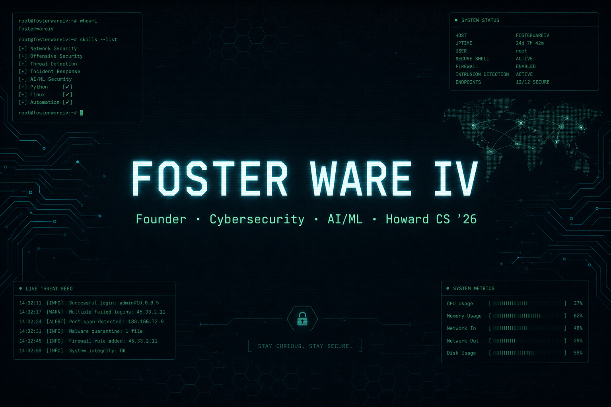

<!--
  Profile README for github.com/efdubya4
  Aesthetic: security-console / dark ops dashboard
-->

<p align="center">
  
</p>

<p align="center">
  
</p>

<h1 align="center">Foster Ware IV</h1>

<p align="center">
  <strong>Founder & CEO, Oval Technology Solutions</strong> · Cybersecurity Infrastructure Contractor · CS @ Howard University '26
</p>

<p align="center">
  <a href="https://linkedin.com/in/foster-ware-iv"></a>
  <a href="mailto:fosterware4@gmail.com"></a>
  <a href="https://github.com/efdubya4"></a>
  <a href="https://efdubya4.github.io/academic-cv/"></a>
</p>

<p align="center">
  <code>build secure systems · ship useful software · lead with community</code>
</p>

---

## `/about`

```text
$ whoami --verbose
> Foster Ware IV
> CS student @ Howard University (BS, graduating 2026)
> Founder & CEO, Oval Technology Solutions
> Focus: cybersecurity, DevSecOps, AI/ML, full-stack
```

- 🔭 **Currently building** secure infrastructure and AI-powered solutions at Oval Technology Solutions
- 🛡️ **Also operating as** a cybersecurity infrastructure contractor (Cyberup24) — DevSecOps practices, enterprise compliance
- 🌱 **Learning / refining:** applied AI/ML, cloud security architecture
- 👯 **Looking to collaborate on:** AI-powered developer tools, civic/health tech, security tooling
- 🤔 **Looking for help with:** <!-- TODO: add if you want recruiter/open-source ask --><!-- e.g. early design partners for Oval -->
- 🎓 **CS @ Howard University**, College of Engineering and Architecture, Class of 2026
- 🌍 **Worked across** D.C., Virginia, Alabama, and Zimbabwe
- ⚡ **Fun fact:** <!-- TODO: optional one-liner -->

---

## `/stack`

> One badge language, one look — `for-the-badge` throughout.

### Languages


### Web


### Data


### Cloud / Infra


### Productivity

-2B579A?style=for-the-badge&logo=microsoftword&logoColor=white)
-217346?style=for-the-badge&logo=microsoftexcel&logoColor=white)
-B7472A?style=for-the-badge&logo=microsoftpowerpoint&logoColor=white)

---

## `/experience` *(highlights)*

| Role | Org | Focus |
| --- | --- | --- |
| **Founder & CEO** *(Summer 2025–present)* | [Oval Technology Solutions](https://github.com/efdubya4) | Web development, cybersecurity consulting, AI solutions for enterprise clients — concurrently **cybersecurity infrastructure contractor** at Cyberup24 |
| **Web Dev / Test Engineer Intern** *(Summer–Fall 2024)* | Dewberry — Resilience Solutions | Built a Benefit Cost Analysis tool for natural hazard mitigation; tested flood forecasting software beta releases |
| **Data / Validation** *(Summer–Fall 2023)* | Bitmari (Harare, Zimbabwe) | Data validation for the ILoveBlackPeople Safe Places app and Greenbook API |
| **Power Delivery Technology Intern** *(Summer 2023)* | Alabama Power Company | RSA rollout project; FISR system data work |
| **QA + Teaching** *(Summers 2021 & 2022)* | Apple × Ed Farm | QA for Ed Farm Learn's launch; taught Swift Code to middle and high schoolers |

> Full timeline + detail: **[Academic CV site](https://efdubya4.github.io/academic-cv/)**

---

## `/projects` *(flagship)*

<table>
  <tr>
    <td width="50%" valign="top">
      <h3>🩺 PreFreshman Experience — Research Mentor</h3>
      <p><strong>AUC Data Center</strong></p>
      <p>Mentored 6 undergrads in Python, data analytics, and healthcare data science focused on cancer outcomes and social determinants of health.</p>
      <p><!-- TODO: repo/demo URL --></p>
    </td>
    <td width="50%" valign="top">
      <h3>💬 Small Business Chatbot Assistant</h3>
      <p><strong>Howard / AWS</strong></p>
      <p>AI chatbot for small-business marketing, churn prediction, and strategy. Built with Lambda, Lex, S3, and DynamoDB in a 5-person team.</p>
      <p><!-- TODO: repo/demo URL --></p>
    </td>
  </tr>
  <tr>
    <td width="50%" valign="top">
      <h3>🎵 Music Data Analysis</h3>
      <p>NLP + sentiment analysis tooling to categorize songs by popularity and lyric content.</p>
      <p><a href="https://github.com/efdubya4/NLP_Song_Analysis">github.com/efdubya4/NLP_Song_Analysis</a></p>
    </td>
    <td width="50%" valign="top">
      <h3>🌐 NGA Research Project</h3>
      <p>Python simulation of nuclear effects on biodiversity, built with the National Geospatial-Intelligence Agency.</p>
      <p><!-- TODO: confirm official agency naming / repo URL on resume --></p>
    </td>
  </tr>
  <tr>
    <td width="50%" valign="top" colspan="2">
      <h3>⚡ Bison Bytes Hackathon</h3>
      <p>Full-stack app built in 24 hours using an LLM to assess patient–doctor interactions and reduce malpractice risk.</p>
      <p><!-- TODO: repo/demo URL --></p>
    </td>
  </tr>
</table>

---

## `/values` *(leadership & community)*

- **IEEE** member · **NSBE** member · Engineering Mentor at Howard's College of Engineering and Architecture
- Regional Teen President — Jack and Jill of America · Kappa League President / Junior Advisor
- **Howard Alternative Spring Break** — youth empowerment & gun violence prevention (Milwaukee)
- **1st place**, Cyberthon Pensacola (Fall 2018, high school division — cybersecurity / threat detection)

Building things that serve real communities: HBCU STEM mentorship, youth empowerment, and safety-focused applications — with a **security-first** engineering posture.

---

## `/connect`

<p align="center">
  <a href="https://linkedin.com/in/foster-ware-iv"></a>
  <a href="mailto:fosterware4@gmail.com"></a>
  <a href="https://github.com/efdubya4"></a>
  <a href="https://efdubya4.github.io/academic-cv/"></a>
</p>

```text
# <!-- TODO: add when live -->
# Portfolio:  https://YOUR-PORTFOLIO-URL
# Twitter/X:  https://x.com/YOUR_HANDLE
```

Open to **software engineering**, **cybersecurity**, and **AI/ML** roles — and conversations with collaborators / investors interested in Oval Technology Solutions.

---

## `/stats`

<p align="center">
  
  
</p>

<p align="center">
  
  
</p>

---

<p align="center">
  <sub>security-first · community-rooted · always shipping</sub>
</p>
